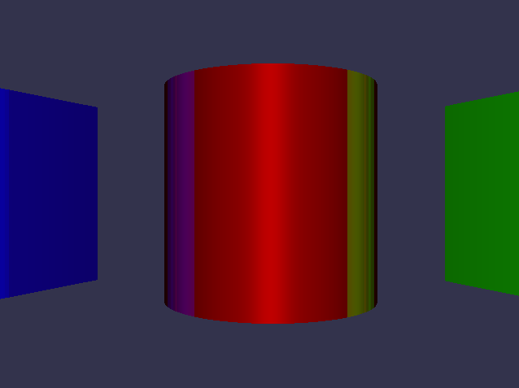

# Raytracing Project
### by Advanced Programming Team 85
## Second Sprint

1. New cmake based build procedure: 
    1. Make sure you have installed SDL for rendering to screen. On Debian-derived systems, i.e. Ubuntu or Mint, you can install this library with the command `sudo apt install libsdl2-dev`.
    2. `mkdir build && cd build` to create the build directory and switch to that directory.
    3. `cmake ..` to configure the project. The path to the SDL headers should be detected automatically.
    4. `make` to build the project.
    5. `./RaytracerADP` to run the executable.
2. Refactor the scene geometry description to utilize object oriented programming features. Both `Circle` and `Box` now inherit from `SceneGeometry`, a purely virtual class providing an interface for intersection with rays. 
3. Implement movement using the arrow keys/WASD and camera rotation using the mouse. To rotate the camera to the left, move the cursor to the left half of the screen. To rotate right, move the cursor to the right half of the screen. If you do not want to rotate the camera, move the mouse to the center of the screen. We understand that this is janky and kinda suboptimal, but it is the only mouse input that consistently works with WSL2 GUI windows. Warping the cursor to the center of the screen does not work on WSL2, so with standard First-Person-Game-style camera rotation based on the movement (not the position) of the mouse, rotation would be limited by the cursor reaching the edges of the GUI window. The current implementation at least allows for unlimited rotation in every direction.
To quit the program, press q, or click the close button of the window, or press Ctrl+C in the command window you executed the program in.
To reset the camera to its starting position, press r.
4. Color was invented.
5. The average time taken by every step of the image generation is printed to the console after the program ends.
6. Implemented the Blinn-Phong local illumination model https://en.wikipedia.org/wiki/Blinn%E2%80%93Phong_reflection_model
7. Switched from deferred rendering to recursive raytracing. Enjoy the reflections!

## What is raytracing?
Generally speaking, raytracing is the process of tracing a ray (defined by a starting position and a direction) in a scene, looking for an intersection with the scene, Raytracing has many applications, i.e. thermal radiation modeling, modeling of nuclear blasts (yes, the first paper on raytracing with computers was about that), or most famously, computer graphics.
  Raytracing is popular in computer graphics because it can be used for rather intuitive modelling of light. Basically, you send a ray into the scene, see where it hits an object, then you send additional rays from the intersection points until you hit a light source. 
Turner Whitted popularized recursive raytracing in computer graphics in 1980 https://dl.acm.org/doi/pdf/10.1145/280811.280983 and Kajiya provided the theoretical basis for all modern physically based rendering using raytracing https://dl.acm.org/doi/pdf/10.1145/15922.15902, the rendering equation.
  For this project, we only implemented 2d raytracing, and also did not implement transparency and refraction effects, like Whitted did. To get colors from only a single intersection, not tracing a very high number of rays in all directions, we implemented simple shading functions from the domain of real-time computer graphics instead.
